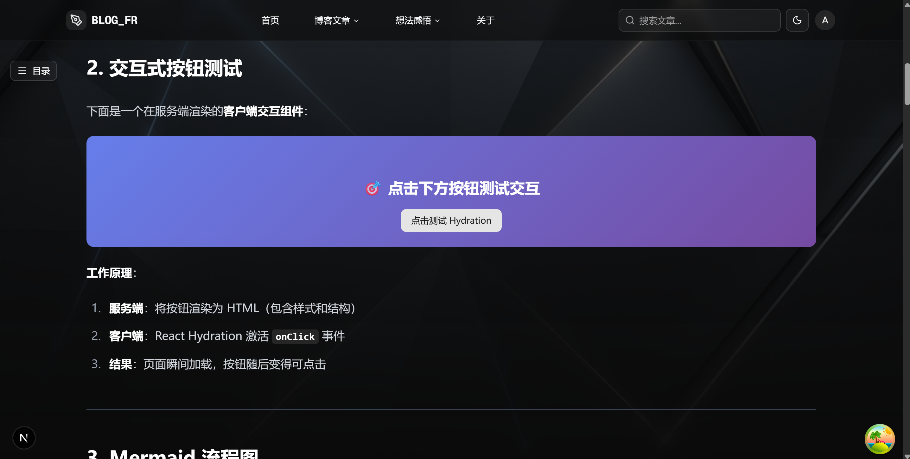
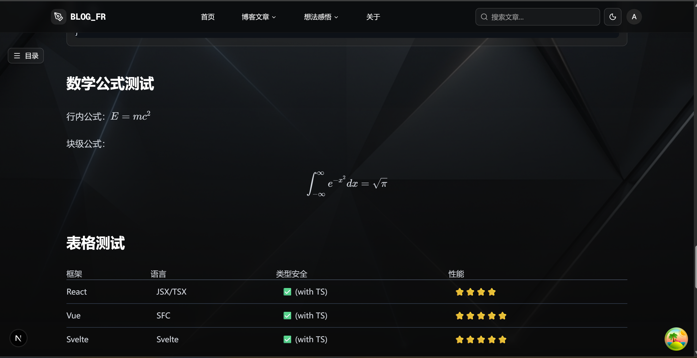

# 图片引用功能测试

这篇文章用于测试 MDX 文章中的图片引用功能。

## 封面图片

文章的封面图片通过 frontmatter 中的 `cover` 字段设置：

```yaml
cover: ./cover-test.png
```

封面图片应该显示在文章列表和文章详情页的顶部。

## 正文中的图片引用

### 相对路径引用

使用相对路径引用同目录下的图片：



### 图片说明文字

带有说明文字的图片：



_图：MDX 支持的数学公式渲染效果_

## 图片引用的最佳实践

1. **使用相对路径**：图片放在文章同目录下，使用 `./image.png` 引用
2. **添加 alt 文本**：提升可访问性和 SEO
3. **优化图片大小**：建议封面图不超过 1MB
4. **支持的格式**：PNG、JPG、WebP、SVG

## 测试要点

- [ ] 封面图片是否正确显示
- [ ] 正文图片是否正确加载
- [ ] 图片路径解析是否正确
- [ ] 响应式图片是否工作正常

---

**注意**：这是一篇测试文章，用于验证图片引用功能是否正常工作。