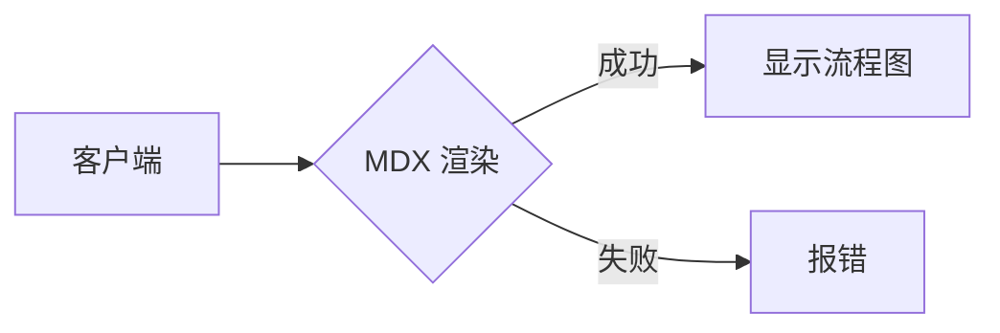

# 客户端 MDX Mermaid 测试

这个文件使用 `enable_jsx: true`，由客户端渲染。

## 测试 Mermaid 流程图



## 测试交互按钮

<InteractiveButton message="客户端 JSX 按钮">
  点击测试 JSX
</InteractiveButton>

## 测试代码高亮

```javascript
function test() {
  console.log('客户端渲染测试');
}
```

## 测试数学公式

行内公式：$E = mc^2$

块级公式：

$$
\int_{-\infty}^{\infty} e^{-x^2} dx = \sqrt{\pi}
$$

## 总结

如果你能看到：
- ✅ 流程图正常显示
- ✅ 按钮可以点击并弹出 alert
- ✅ 代码高亮正常
- ✅ 数学公式正常

说明客户端 MDX 渲染完全正常！