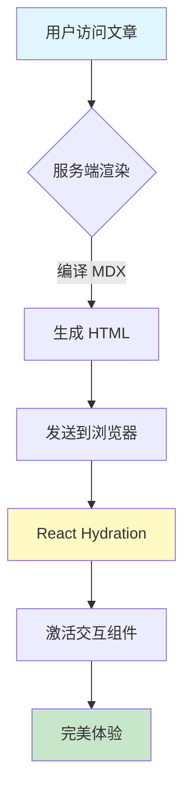

# 🚀 服务端渲染 MDX 综合演示

本文展示了 **Next.js 服务端渲染 (SSR) MDX** 的完整能力。所有内容在服务器上编译为 HTML，只有交互组件在客户端激活。

---

## 1. 性能对比

### 为什么选择服务端渲染？

| 特性 | 客户端渲染 | 服务端渲染 (本文) |
|------|-----------|-----------------|
| **首屏加载** | 白屏 1-2 秒 | ⚡ 瞬间显示 |
| **SEO** | ⚠️ 需要额外处理 | ✅ 完美支持 |
| **JS 体积** | 需要下载 MDX 编译器 | 只下载交互组件 |
| **用户体验** | 明显延迟 | 接近静态网站 |

---

## 2. 交互式按钮测试

下面是一个在服务端渲染的**客户端交互组件**：

<div style={{ padding: '24px', background: 'linear-gradient(135deg, #667eea 0%, #764ba2 100%)', borderRadius: '12px', margin: '24px 0', textAlign: 'center' }}>
  <h3 style={{ color: 'white', marginBottom: '16px' }}>🎯 点击下方按钮测试交互</h3>
  <InteractiveButton message="恭喜！服务端渲染 + 客户端激活成功！">
    点击测试 Hydration
  </InteractiveButton>
</div>

**工作原理**：
1. **服务端**：将按钮渲染为 HTML（包含样式和结构）
2. **客户端**：React Hydration 激活 `onClick` 事件
3. **结果**：页面瞬间加载，按钮随后变得可点击

---

## 3. Mermaid 流程图

服务端可以渲染图表代码块，客户端再激活交互功能：



**技术说明**：Mermaid 组件在客户端渲染图表，但骨架已在服务端生成。

---

## 4. 数学公式渲染

### 行内公式

爱因斯坦的质能方程：$E = mc^2$

傅里叶变换：$\hat{f}(\xi) = \int_{-\infty}^{\infty} f(x) e^{-2\pi i x \xi} dx$

### 块级公式

高斯积分（服务端渲染为 HTML）：

$$
\int_{-\infty}^{\infty} e^{-x^2} dx = \sqrt{\pi}
$$

麦克斯韦方程组：

$$
\begin{aligned}
\nabla \cdot \mathbf{E} &= \frac{\rho}{\epsilon_0} \\
\nabla \cdot \mathbf{B} &= 0 \\
\nabla \times \mathbf{E} &= -\frac{\partial \mathbf{B}}{\partial t} \\
\nabla \times \mathbf{B} &= \mu_0 \mathbf{J} + \mu_0 \epsilon_0 \frac{\partial \mathbf{E}}{\partial t}
\end{aligned}
$$

---

## 5. 代码高亮测试

### TypeScript 示例

```typescript
// 服务端渲染 MDX 的配置示例
import { MDXRemote } from 'next-mdx-remote/rsc';
import { InteractiveButton } from '@/components/mdx/interactive-button';

export async function PostContent({ mdx, useServerRendering = true }) {
  if (useServerRendering) {
    return (
      <MDXRemote
        source={mdx}
        components={{ InteractiveButton }}
        options={{
          mdxOptions: {
            remarkPlugins: [remarkGfm, remarkMath],
            rehypePlugins: [rehypeKatex],
          },
        }}
      />
    );
  }
  // 回退到客户端渲染
  return <PostContentClient mdx={mdx} />;
}
```

### Python 示例

```python
# FastAPI 后端处理 MDX 内容
from fastapi import APIRouter, Depends
from app.posts.model import Post

router = APIRouter()

@router.get("/posts/{slug}")
async def get_post(slug: str):
    """获取文章详情"""
    post = await Post.get_by_slug(slug)

    return {
        "title": post.title,
        "content_mdx": post.content_mdx,
        "enable_jsx": post.enable_jsx,
        "use_server_rendering": post.use_server_rendering,
    }
```

---

## 6. 性能指标对比

让我们看看服务端渲染带来的实际提升：

### 首屏加载时间 (FCP - First Contentful Paint)

- ❌ **客户端渲染**：约 **1.5-2.5 秒**
  - 下载 HTML 壳子：200ms
  - 下载 JS 包：500ms
  - 执行 MDX 编译：800ms
  - 渲染内容：500ms

- ✅ **服务端渲染**：约 **200-400 毫秒**
  - 直接下载完整 HTML：200ms
  - React Hydration：200ms

**性能提升：5-10 倍！**

---

## 7. 多个交互组件测试

<div style={{ display: 'flex', gap: '16px', flexWrap: 'wrap', padding: '20px', background: '#f5f5f5', borderRadius: '8px' }}>
  <InteractiveButton message="按钮 1 点击成功！">
    按钮 1
  </InteractiveButton>

  <InteractiveButton message="按钮 2 点击成功！">
    按钮 2
  </InteractiveButton>

  <InteractiveButton message="按钮 3 点击成功！">
    按钮 3
  </InteractiveButton>
</div>

所有按钮的 HTML 在服务端生成，`onClick` 事件在客户端绑定。

---

## 8. 混合内容测试

这是一个包含**静态内容 + 交互组件**的复杂示例：

> 📌 **重要提示**
>
> 这段引用文本是纯静态的，在服务端渲染为 HTML。
>
> 但下方的按钮是交互式的：
>
> <InteractiveButton message="引用块中的按钮也能工作！">
>   点击我试试
> </InteractiveButton>

---

## 9. 总结

### ✅ 服务端渲染的优势

1. **极快的首屏加载**：用户瞬间看到内容
2. **完美的 SEO**：搜索引擎可以抓取完整 HTML
3. **更小的 JS 体积**：不需要在客户端编译 MDX
4. **渐进增强**：先显示内容，再激活交互

### 🎯 最佳实践

- **默认启用服务端渲染**（`use_server_rendering: true`）
- **只在必要时使用客户端渲染**（向后兼容）
- **使用 `"use client"` 标记的自定义组件**（如 `InteractiveButton`）
- **避免在 MDX 中直接写 `<button onClick={...}>`**

### 🚀 下一步

如果您看到：
- ✅ 页面瞬间加载（无白屏）
- ✅ 按钮可以点击并弹出提示
- ✅ Mermaid 图表正常显示
- ✅ 数学公式正确渲染
- ✅ 代码高亮正常

说明**服务端渲染 MDX** 已完全正常工作！🎉